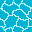
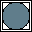
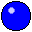
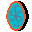
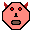

# RGBalls

Simple logic game, where main objective is to move all red, green and blue balls to pads of the same color.

Game was created using Pygame. All images are my own creations. To make most of them, I used [www.pixilart.com](http://www.pixilart.com).

Run the game: go to src and `python RGBalls.py`.

#### Menu navigation:
* Left/Down arrow - choose previous level
* Right/Up arrow - choose next level
* PageDown, PageUp - choose level (±5)
* q/Esc - quit game
* Enter - start level

#### Game navigation:
* arrows - move
* q/Esc - go back to main menu
* h - switch HUD (stats/items/none)
* z/x - choose previous/next item
* Space - use item
* r - retry level

## Custom levels

Each level has five layers:
 * background - layer for tiles,
 * three layers for objects,
 * foreground (filled only through objects).
 
Right now you don't have to care about objects' layers. Ghost is in the upper layer, Hell Entrance is in the lower layer and all other objects are in the middle layer.
#### List of tiles:
 * `#` 
 
   Wall: nothing can move through this.
 * `.` 
 
   Grass: everything can move through this.
 * `_` 
 
   Water: flying objects can move through this.
 * `~` 
 
   Sand: like grass, but balls will stop on this tile.
 * `l` 
 
   Lily leaf: everything can move through this, but putting heavy objects (such as box) will cause it to drown.
 * `r` , `g` , `b` , `u` 
 
   Pods for balls (red, green, blue, universal - white).
 * `R` , `G` , `B` , `U` 
 
   Magnetic pods for balls.

#### Available objects
All objects have as their two first parameters `x` and `y` - coordinates on map.
All objects also have as their last optional parameter `miscellaneous`. One could use it for example to make a container inside object to keep additional variables.

Possible directions are: `'left'`, `'right'`, `'up'` and `'down'`.

List of objects:
 * `Player(x, y, init_function, miscellaneous)` 
   
   Primary game object. Each level needs exactly one player.
   `init_function` is optional parameter. It should be function, which takes one parameter: game instance. Function will be called once, right before first game loop.
 * `Ball(x, y, color, miscellaneous)`   
   
   Player's main goal is to push balls into pads. Once pushed, ball will keep going until it meets an obstacle or moves into sand or magnetic pad.
   `color` should be one of three colors: `'red'`, `'green'` or `'blue'`.
 * `Box(x, y, miscellaneous)` 
   
   Simple, heavy box. Can be pushed and drown.
 * `Diamond(x, y, miscellaneous)` 
   
   Collect all diamonds to receive 2nd star.
 * `Envelope(x, y, message, miscellaneous)` 
   
   Player can pick it up to read a `message`.
 * `Portal(x, y, destination_x, destination_y, miscellaneous)` 
   
   On touch, portal will transport player to `(destination_x, destination_y)` (if that place is empty).
 * `Cannonball(x, y, direction, speed, miscellaneous)` 
   
   Cannonball moves in `direction` with `speed`. Upon colliding with player, game is over. Upon colliding with wall or another object, cannonball is destroyed.
 * `Cannon(x, y, direction, shooting_delay_function, bullet_speed_function, miscellaneous)` 
   
   Cannon shoots cannonballs in `direction`. `shooting_delay_function` and `bullet_speed_function` are functions that take one argument: one natural number.
   Cannon will wait `shooting_delay_function(n)` before shooting `n`-th ball (starting from `n = 0`) and `n`-th ball's speed is `bullet_speed_function(n)`.
 * `Door(x, y, container, miscellaneous)` 
   
   `container` is dictionary which should contain at least one of those:
   * `'condition_on_update'`: function which takes two arguments: game instance and `container`, and returns `True` or `False` depending on whether door should be opened.
   * `'condition_on_touch'`: function which takes three arguments: game instance, `direction`, from which door was touched and `container`, and returns `True` or `False` depending on whether door should be opened.
 * `LittleDevil(x, y, speed, health=0, miscellaneous)` 
   
   First enemy of the player with very simple AI: he will try to go towards the player, taking the shortest path (and will be blocked by any obstacle or wall on its way).
   `health` is amount of times little devil needs to be hit to be destroyed. If `health <= 0`, little devil is indestructible. 
 * `Ghost(x, y, speed, path, miscellaneous)` 
   
   Another enemy. Ghosts move in loop. They float in upper layer, so they don't collide with most objects. However, player still needs to avoid them.
   `path` is a list of coordinates. Ghost's path is loop: `(x, y) -> path[0] -> path[1] -> ... -> path[len(path) - 1] -> (x, y) -> path[0] -> ...`.
   Points need to be in line, so if ghost moves from point `(a, b)` to `(c, d)`, there must be `a == c` or `b == d`.
 * `HellEntrance(x, y, frequency, speed, health=1, miscellaneous)` 
   
   Hell entrance spawns little devils with `speed` and `health` every `frequency` frames. This object is in lower layer.
 * `Event(x, y, event, times_triggered=1, miscellaneous)`
   
   While technically `Event` is not an object (`Event`s have their own layer), level creator should put them in objects' list.
   When player moves onto `(x, y)` field, function `event` will be triggered. It takes 2 arguments: game instance and self.
   Event will trigger `times_triggered` times, then it will disappear. If `times_triggered <= 0`, event will never disappear.

#### Items
Player can use items only if he stands still.
 * `Gun()` 
 
   Player shoots a cannonball.
 * `SpeedPill()` 
 
   Consume it to move faster.
 * `LilyPlant()` 
 
   Player puts a lily on a water.

#### Creating new objects/items, API
For list of frequently called methods check documentation of abstract classes `GameObject` and `MovingObject` in `objects.py`.
For list of necessary methods for item, check abstract class `Item` in `items.py`. Items are parameterless.
All `MovingObject`s have method `modify_speed(delta)`.
To add items to player's inventory, call method `add_item(item, amount=1)`.
All objects and `Event`s have `miscellaneous` parameter, which you can use as container to keep and check additional information about particular object.

#### How to make your own level?
Create `Level` object with 5 parameters:
 * `width` and `height`,
 * `tiles` - list of strings (needs to be rectangle of size `width` x `height`)
   
   Tiles will be surrounded with `#` from both sides.
 * `objects` - list of objects
   
   Use `(x, y)` coordinates, where `(1, 1)` are coordinates of top left corner.
 * `steps` - maximum number of steps allowing player to receive 3rd star.

Add it to `levels` array in function `generate_levels` in file `levels.py`. Here, you can also edit already existing levels.